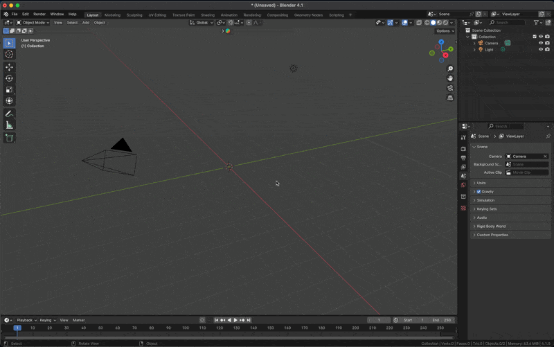

Create a Rubiks Cube with a specified number of faces.
The option to do so can be found on the right sidebar panel, which can be displayed using the shortcut "n".

Instructions for installation:

1. Compress the project into a zip file.
2. In Blender preferences, navigate to the "Add-ons" section.
3. Click on "Import" and select the zip file.

How to use the add-on:

